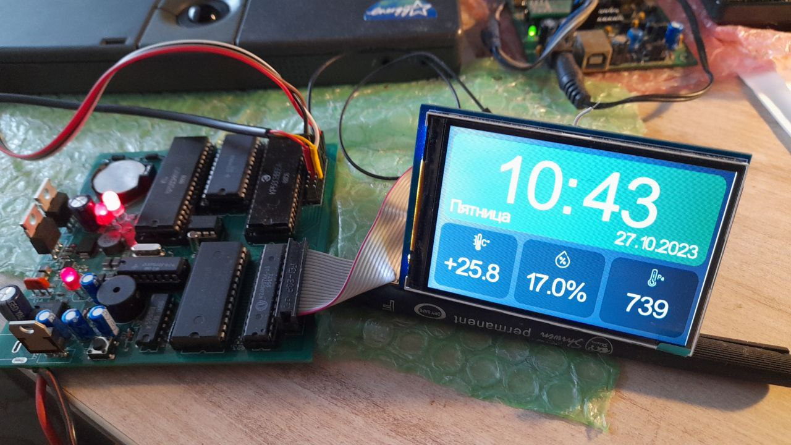
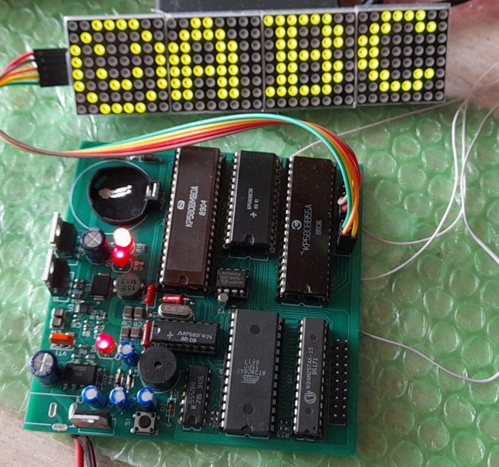
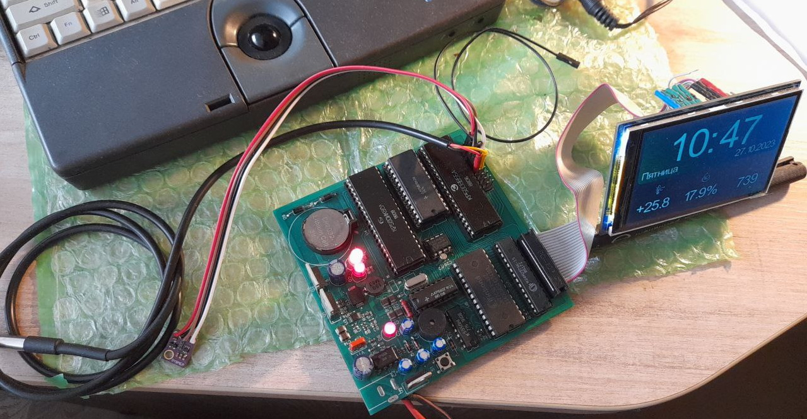
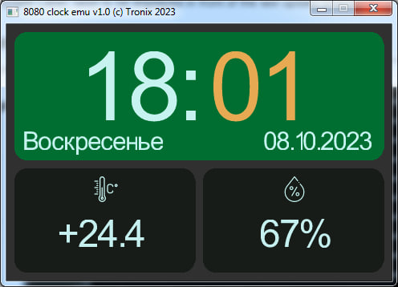

# i8080 homebrew digital clock/weather station

Hardware and software platform for experements with i8080 CPU. At current stage it has 3.5" TFT screen, I2C and 1-wire sensors and firmware for digital clock, thermometer, barometer and humidity.

## Hardware
PCB itself include:
- Onboard power supply for proper i8080 voltages (minus 5V, plus 5V and plus 12V) and power sequence;
- i8080 (KR580VM80) main CPU;
- i8224 (KR580VG24) clock generator;
- i8238 (KR580VK38) bus controller;
- i8255 (KR580VV55) PIO controller for keys, I2C bus, 1-wire bus;
- 32Kb ROM (27c256) and 32Kb RAM (62256);
- Real-time-clock i2c PCF8563P with battery holder and 32KHz crystal;
- BUS connector to connect devices directly to internal data BUS (used by TFT screen with parallel interface);
- PIO Extensions connector to connect buttons, 1-wire devices (like DS18B20), i2c sensors (like BME280) and other:

The following devices are connected externally to the board:
- 3.5inch TFT LCD screen 480x320 ILI9486 parallel interface;
- BME280 i2c sensor (temperature, humidity, pressure);
- DS18B20 1-wire sensor (temperature);
- buttons (keys);

## Software
For building [firmware](/software/firmware) you need install [z88dk](https://github.com/z88dk/z88dk) and then add new "clock80" target. 
Copy files from [clock80](software/z88dk_target/clock80) directory in `z88dk\lib\target\clock80`. Also copy `clock80.cfg` file to `z88dk\lib\config` . 
Iam using batch script `makeit.bat` for build final firmware named `full.bin`.

For debugging there is a small [emulator](/software/emulator) of this platform:

Building with MinGW `makefile`
